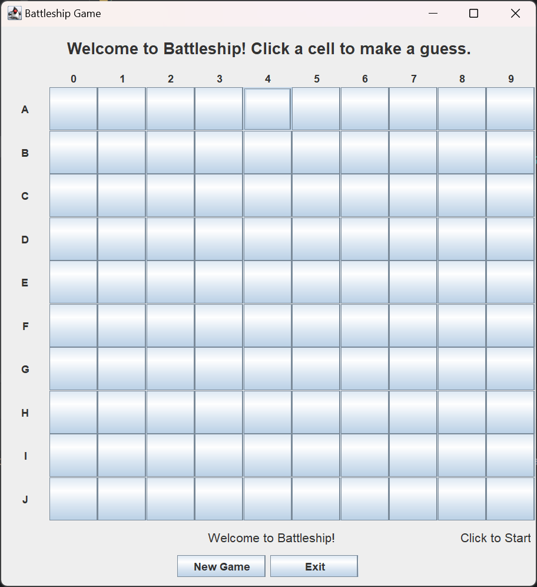
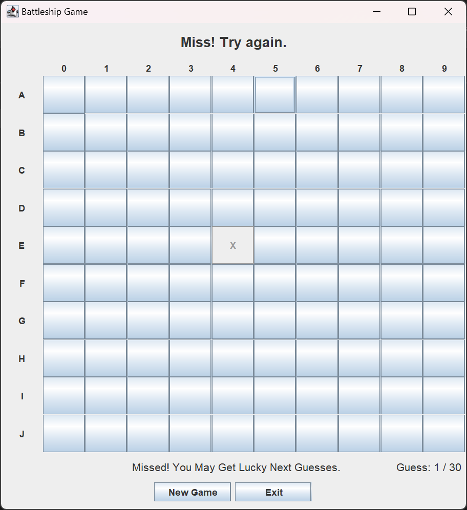
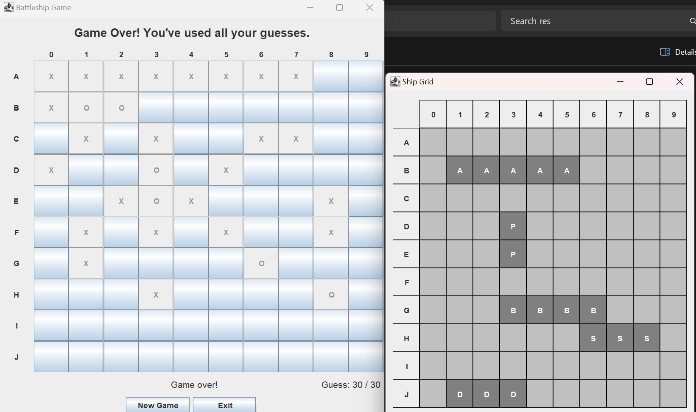

# Battleship Game

## Overview

This project is a Java implementation of the classic Battleship game. The game is played on a 10x10 grid where the player aims to guess and hit all the ships randomly placed on the grid. The player has a maximum of 50 guesses. The game ends when either all ships are sunk or the guess limit is reached. Ships are revealed after the game ends.





## Features

- **MVC Architecture**: The game follows the Model-View-Controller (MVC) design pattern.
- **Graphical User Interface**: The game uses Java Swing for the GUI.
- **Random Ship Placement**: Ships are placed randomly on the grid.
- **Game State Management**: The game tracks the state of the grid, guesses, and ships.
- **User Interaction**: Players can interact with the game through a graphical interface.

## Components

### Model

- `BattleshipModel`: Interface defining the methods for the game model.
- `BattleshipModelImpl`: Implementation of the `BattleshipModel` interface.
- `Ship`: Represents a ship in the game.
- `ShipType`: Enum representing different types of ships.
- `CellState`: Enum representing the possible states of a cell on the game grid.

### View

- `BattleshipViewGui`: Interface defining the methods for the game view.
- `SwingBattleshipView`: Implementation of the `BattleshipViewGui` interface using Java Swing.

### Controller

- `BattleshipController`: Interface defining the methods for the game controller.
- `SwingBattleshipController`: Implementation of the `BattleshipController` interface using Java Swing.

### Main

- `Main`: Contains the main method to run the game.

## How to Run

1. **Clone the repository**:
    ```sh
    git clone https://github.com/lhq5520/BattleshipGame-GUI.git
    cd battleship
    ```

2. **Compile the project**:
    ```sh
    javac -d bin src/battleship/*.java
    ```

3. **Run the game**:
    ```sh
    java -cp bin battleship.Main
    ```

## Usage

- **Start a New Game**: Click the "New Game" button to start a new game.
- **Make a Guess**: Click on a cell in the grid to make a guess.
- **View Results**: The game will display hits, misses, and the final ship placements after the game ends.

## Classes and Interfaces

### `BattleshipModel`

Defines the methods required for the game model.

### `BattleshipModelImpl`

Implements the `BattleshipModel` interface, managing the game state, ship placements, and guesses.

### `Ship`

Represents a ship in the game, including its type, coordinates, and hit count.

### `ShipType`

Enum representing different types of ships, each with a size and symbol.

### `CellState`

Enum representing the possible states of a cell on the game grid (UNKNOWN, HIT, MISS).

### `BattleshipViewGui`

Defines the methods required for displaying the game state and interacting with the player.

### `SwingBattleshipView`

Implements the `BattleshipViewGui` interface using Java Swing, providing the graphical interface for the game.

### `BattleshipController`

Defines the methods required for the game controller.

### `SwingBattleshipController`

Implements the `BattleshipController` interface, connecting the model and view, and handling user input.

### `Main`

Contains the main method to run the game.

## License

This project is licensed under the MIT License. See the `LICENSE` file for details.